# 📂 Multi-Template Frontend Ecosystem

Welcome to this frontend architecture repository! This project contains **4 uniquely crafted responsive web templates** designed with clean, professional, component-based modern layouts. Every layout features custom CSS variables, responsive fluid configurations, and specialized keyframes.

---

## 🗺️ Table of Contents
1. [📊 Template 4: Ahmed - Administrative Dashboard Hub](https://frontend-murex-six-74.vercel.app/HTML&CSS_Projects/Template_4/index.html)
2. [⚡ Template 3: Elzero - Dashboard & Complex Component Template](https://frontend-murex-six-74.vercel.app/HTML&CSS_Projects/Template_3/index.html)
3. [🎨 Template 2: Kasper - Creative Portfolio & Art Template](https://frontend-murex-six-74.vercel.app/HTML&CSS_Projects/Template_2/index.html)
4. [🚀 Template 1: Leon - Creative Agency Template](https://frontend-murex-six-74.vercel.app/HTML&CSS_Projects/Template_1/index.html)

---


## 📊 [Administrative Dashboard Hub ](https://frontend-murex-six-74.vercel.app/HTML&CSS_Projects/Template_4/index.html)

### 📌 Project Overview
Ahmed is a comprehensive, production-scale administrative dashboard ecosystem. It provides an all-in-one workspace solution featuring multiple integrated view interfaces, such as data targets tracking, profile management matrices, cloud file storage statistics, social networking modules, and dynamic course learning matrices. The layout features custom responsive controls, a collapsible system sidebar, and specialized visual tools tailored for data analysis.

### 🌟 Key Features
* **Multi-View Sub-Pages:** Fully configured CSS rules styling dedicated viewports for Site Controls, General Settings, Files Management, Student Progress Matrices, and Active Friends dashboards.
* **Smart Collapsible Sidebar:** Features a dynamic layout that shifts from a text-and-icon listing into an ultra-slim, icon-only drawer layout for tight mobile screens.
* **Custom Toggle Controls & Switches:** Incorporates interactive toggle animations and input checkboxes fully overridden through CSS appearance hacks and `::before`/`::after` vector states.
* **Performance Metric Rows:** Built-in floating target meters complete with indicator anchors that shift color contexts automatically based on progress thresholds (Blue, Green, Orange, Red).

### 📸 Preview

<div align="center" style="margin: 25px 0; max-width: 800px; margin-left: auto; margin-right: auto;">

  <!-- Image 1 (Open by default) -->
  <details open style="margin-bottom: 15px; background: rgba(0, 105, 92, 0.05); padding: 12px; border-radius: 12px; border: 1px solid rgba(0, 105, 92, 0.15); text-align: left; direction: ltr;">
    <summary style="font-weight: bold; font-size: 16px; color: #00695c; cursor: pointer; user-select: none;">📸  (Click to Collapse)</summary>
    <div align="center">
      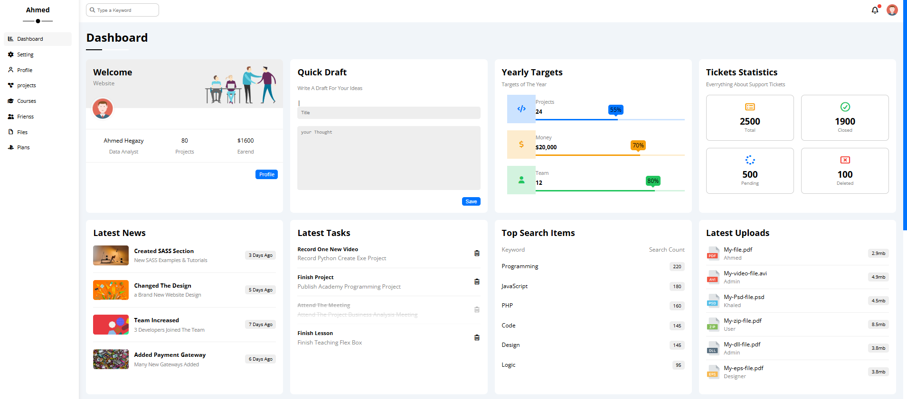
    </div>
  </details>

  <!-- Image 2 -->
  <details style="margin-bottom: 15px; background: rgba(0, 105, 92, 0.05); padding: 12px; border-radius: 12px; border: 1px solid rgba(0, 105, 92, 0.15); text-align: left; direction: ltr;">
    <summary style="font-weight: bold; font-size: 16px; color: #00695c; cursor: pointer; user-select: none;">📸  (Click to Open)</summary>
    <div align="center">
      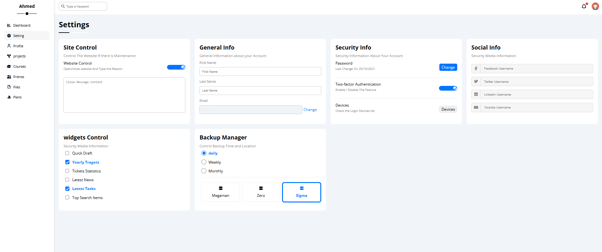
    </div>
  </details>
  <!-- Image 3 -->
  <details style="margin-bottom: 15px; background: rgba(0, 105, 92, 0.05); padding: 12px; border-radius: 12px; border: 1px solid rgba(0, 105, 92, 0.15); text-align: left; direction: ltr;">
    <summary style="font-weight: bold; font-size: 16px; color: #00695c; cursor: pointer; user-select: none;">📸  (Click to Open)</summary>
    <div align="center">
      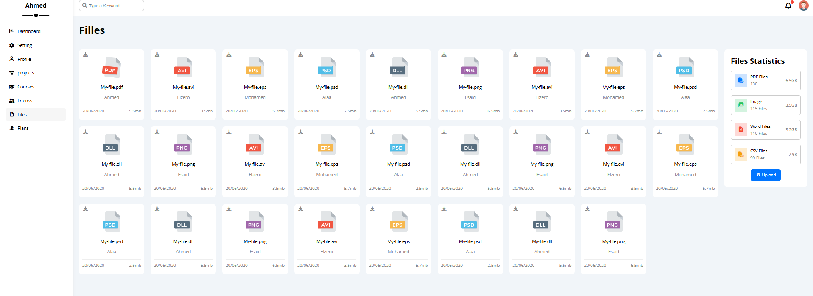
    </div>
  </details>
    </div>


### 🛠️ Tech Stack & Setup
* **Technologies Used:** HTML5, CSS3 (Advanced Flexbox layout modules, CSS variable trees, `@keyframes` tracking loops).
* **Typography:** Open Sans paired with Font Awesome asset packages.

---

## ⚡ [Elzero - Dashboard & Complex Component Template](https://frontend-murex-six-74.vercel.app/HTML&CSS_Projects/Template_3/index.html)

### 📌 Project Overview
Elzero is a feature-rich, multi-component dashboard and community-style web template. It is designed for platform-scale web portals, interactive learning hubs, or tech content networks. The template heavily utilizes CSS custom parameters, multi-axis keyframe animations, complex megamenu dropdown structures, and heavy grid modules to present a dense amount of data blocks in a highly clean layout.

### 🌟 Key Features
* **Interactive Main Title Effect:** Incorporates custom CSS keyframes where background tracking circles seamlessly expand into full block titles upon hovering.
* **Hover-Triggered Megamenu:** Built-in multi-column directory complete with animated header links, structured icons, and adaptive media queries.
* **Extensive Widget Grid:** Stylized interfaces mapping out chronological live event countdown cards, a responsive video playlist previewer, structured corporate team rows, and animated feedback cards.
* **Advanced CSS Visuals:** Features custom geometric clipping structures like background skew angles and complex linear-gradient spikes embedded entirely through CSS pseudo-elements.

### 📸 Preview

<div align="center" style="margin: 25px 0; max-width: 800px; margin-left: auto; margin-right: auto;">

  <!-- Image 1 (Open by default) -->
  <details open style="margin-bottom: 15px; background: rgba(0, 105, 92, 0.05); padding: 12px; border-radius: 12px; border: 1px solid rgba(0, 105, 92, 0.15); text-align: left; direction: ltr;">
    <summary style="font-weight: bold; font-size: 16px; color: #00695c; cursor: pointer; user-select: none;">📸  (Click to Collapse)</summary>
    <div align="center">
      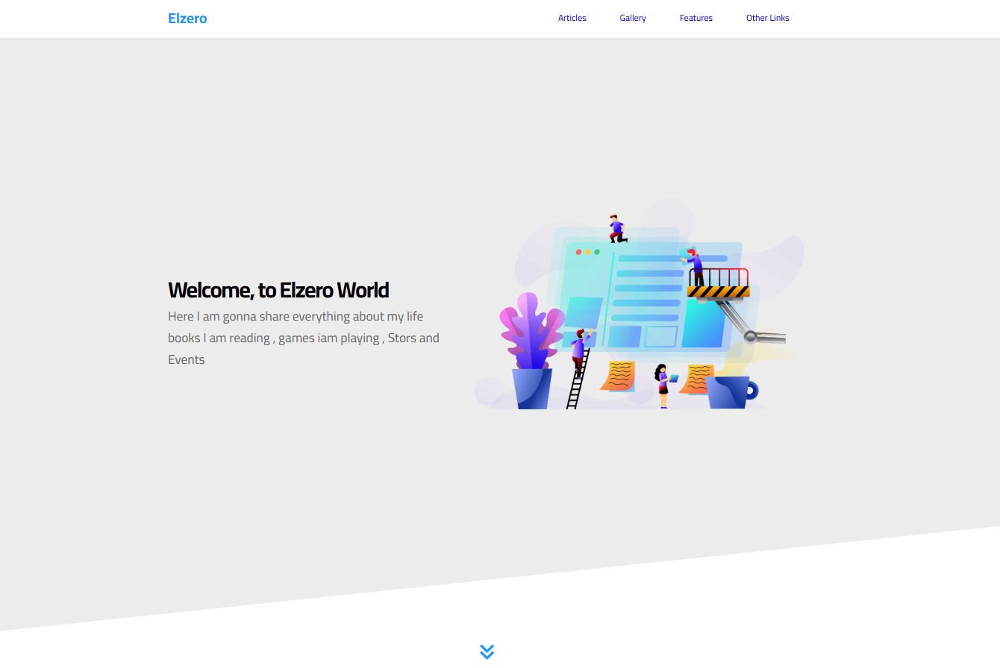
    </div>
  </details>

  <!-- Image 2 -->
  <details style="margin-bottom: 15px; background: rgba(0, 105, 92, 0.05); padding: 12px; border-radius: 12px; border: 1px solid rgba(0, 105, 92, 0.15); text-align: left; direction: ltr;">
    <summary style="font-weight: bold; font-size: 16px; color: #00695c; cursor: pointer; user-select: none;">📸  (Click to Open)</summary>
    <div align="center">
      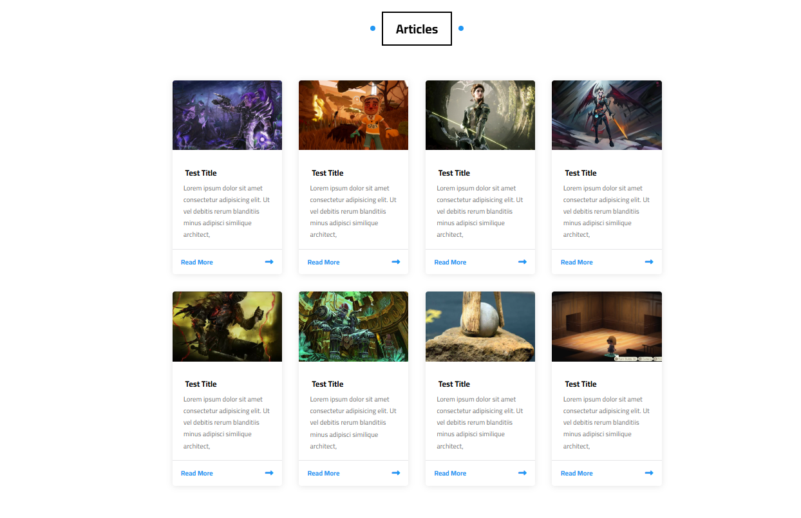
    </div>
  </details>
  <!-- Image 3 -->
  <details style="margin-bottom: 15px; background: rgba(0, 105, 92, 0.05); padding: 12px; border-radius: 12px; border: 1px solid rgba(0, 105, 92, 0.15); text-align: left; direction: ltr;">
    <summary style="font-weight: bold; font-size: 16px; color: #00695c; cursor: pointer; user-select: none;">📸  (Click to Open)</summary>
    <div align="center">
      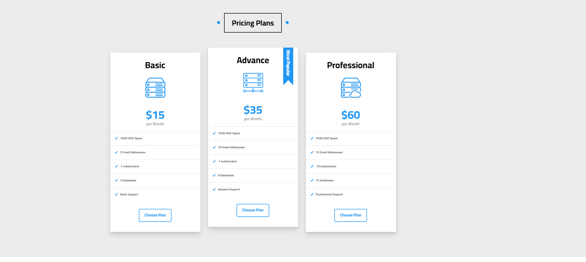
    </div>
  </details>
    </div>

### 🛠️ Tech Stack & Setup
* **Technologies Used:** HTML5, CSS3 (Advanced `@keyframes`, Pseudo-elements, CSS Grid & Flexbox).
* **Typography:** Cairo font family paired with Font Awesome 5 Free vectors.

---

## 🎨 [Kasper - Creative Portfolio & Art Template](https://frontend-murex-six-74.vercel.app/HTML&CSS_Projects/Template_2/index.html)

### 📌 Project Overview
Kasper is a premium, feature-rich corporate portfolio web template styled specifically for artistic agencies, digital creators, and professional design studios. It uses a sleek dark-themed header layout coupled with vivid overlay backgrounds, text modules, custom filtering tabs, and fully stylized interactive components to offer users a cinematic and immersive experience.

### 🌟 Key Features
* **Interactive Portfolio Grid:** Includes an image gallery complete with smooth mouse-hover scale animations, custom rotate transformations, and slide-up text captions.
* **Integrated Video Showcase:** Features a beautiful text overlay and button elements embedded right over a clean HTML video background section.
* **Live Progress Indicators:** Dynamic progress-bar layouts embedded with styling attributes to represent professional team skill meters visually.
* **Complete Business Layouts:** Comes with distinct styling for interactive pricing matrix tables, newsletter subscription blocks, stats counting boards, testimonials modules, and structured map/contact information fields.

### 📸 Preview

<div align="center" style="margin: 25px 0; max-width: 800px; margin-left: auto; margin-right: auto;">

  <!-- Image 1 (Open by default) -->
  <details open style="margin-bottom: 15px; background: rgba(0, 105, 92, 0.05); padding: 12px; border-radius: 12px; border: 1px solid rgba(0, 105, 92, 0.15); text-align: left; direction: ltr;">
    <summary style="font-weight: bold; font-size: 16px; color: #00695c; cursor: pointer; user-select: none;">📸  (Click to Collapse)</summary>
    <div align="center">
      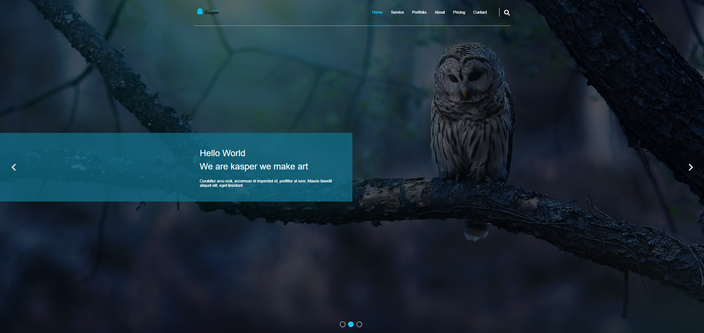
    </div>
  </details>

  <!-- Image 2 -->
  <details style="margin-bottom: 15px; background: rgba(0, 105, 92, 0.05); padding: 12px; border-radius: 12px; border: 1px solid rgba(0, 105, 92, 0.15); text-align: left; direction: ltr;">
    <summary style="font-weight: bold; font-size: 16px; color: #00695c; cursor: pointer; user-select: none;">📸  (Click to Open)</summary>
    <div align="center">
      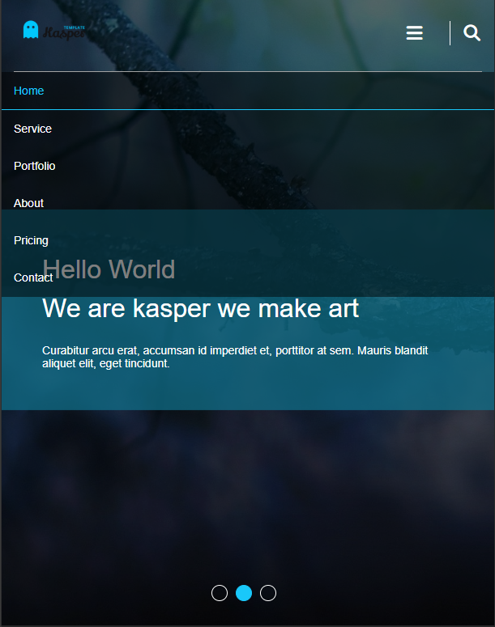
    </div>
  </details>
  <!-- Image 3 -->
  <details style="margin-bottom: 15px; background: rgba(0, 105, 92, 0.05); padding: 12px; border-radius: 12px; border: 1px solid rgba(0, 105, 92, 0.15); text-align: left; direction: ltr;">
    <summary style="font-weight: bold; font-size: 16px; color: #00695c; cursor: pointer; user-select: none;">📸  (Click to Open)</summary>
    <div align="center">
      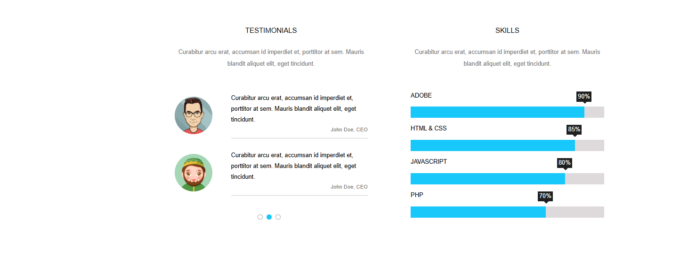
    </div>
  </details>
    </div>


---

## 🚀 [Leon - Creative Agency Template](https://frontend-murex-six-74.vercel.app/HTML&CSS_Projects/Template_1/index.html)

### 📌 Project Overview
Leon is a modern, minimal, and fully responsive multi-page agency web template. It is carefully crafted to help creative agencies, freelancers, and designers showcase their business beautifully. The design relies on clean typography, smooth transitions, and grid-based layouts to present professional services and portfolio works seamlessly.

### 🌟 Key Features
* **Fully Responsive:** Adapts beautifully across mobile, tablet, and desktop viewports.
* **Modern UI Components:** Features large minimal headings, custom CSS grid layouts, and a responsive toggle menu.
* **Smooth Navigation:** Built-in smooth scrolling behaviors for a fluid user experience.
* **Rich Sections:** Includes Hero Landing, Feature highlights, Detailed Services, dynamic Portfolio grid, About us layout, and an organized Contact section.

### 📸 Preview

<div align="center" style="margin: 25px 0; max-width: 800px; margin-left: auto; margin-right: auto;">

  <!-- Image 1 (Open by default) -->
  <details open style="margin-bottom: 15px; background: rgba(0, 105, 92, 0.05); padding: 12px; border-radius: 12px; border: 1px solid rgba(0, 105, 92, 0.15); text-align: left; direction: ltr;">
    <summary style="font-weight: bold; font-size: 16px; color: #00695c; cursor: pointer; user-select: none;">📸  (Click to Collapse)</summary>
    <div align="center">
      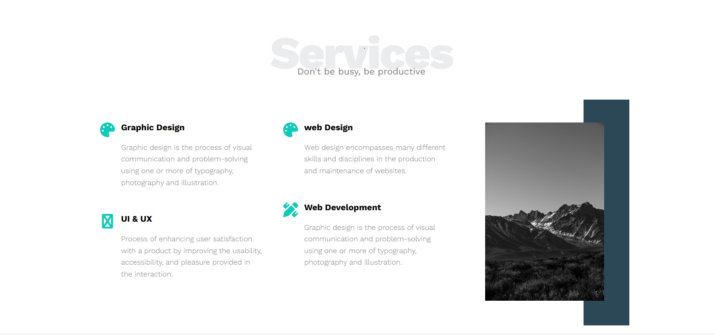
    </div>
  </details>

  <!-- Image 2 -->
  <details style="margin-bottom: 15px; background: rgba(0, 105, 92, 0.05); padding: 12px; border-radius: 12px; border: 1px solid rgba(0, 105, 92, 0.15); text-align: left; direction: ltr;">
    <summary style="font-weight: bold; font-size: 16px; color: #00695c; cursor: pointer; user-select: none;">📸  (Click to Open)</summary>
    <div align="center">
      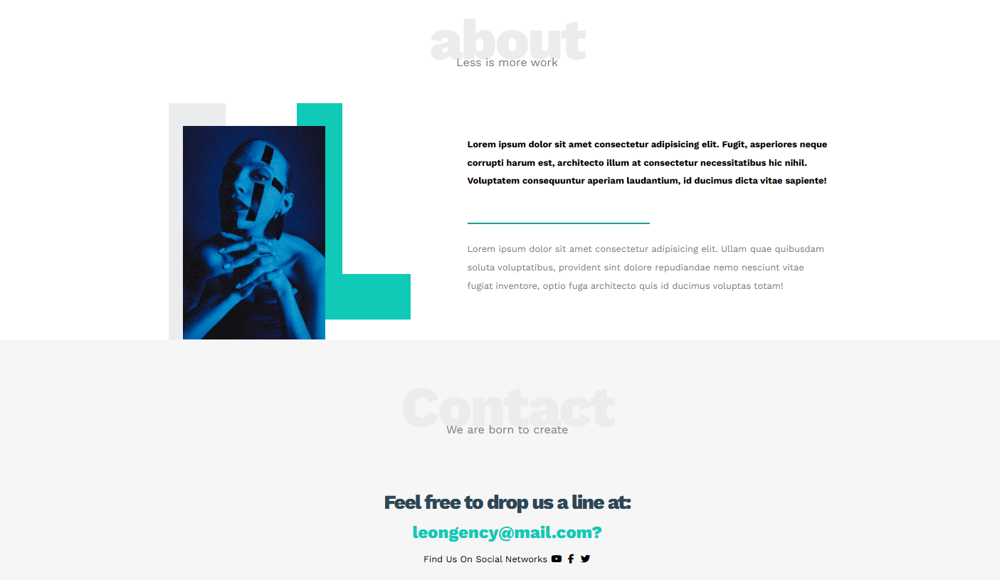
    </div>
  </details>
  <!-- Image 3 -->
  <details style="margin-bottom: 15px; background: rgba(0, 105, 92, 0.05); padding: 12px; border-radius: 12px; border: 1px solid rgba(0, 105, 92, 0.15); text-align: left; direction: ltr;">
    <summary style="font-weight: bold; font-size: 16px; color: #00695c; cursor: pointer; user-select: none;">📸  (Click to Open)</summary>
    <div align="center">
      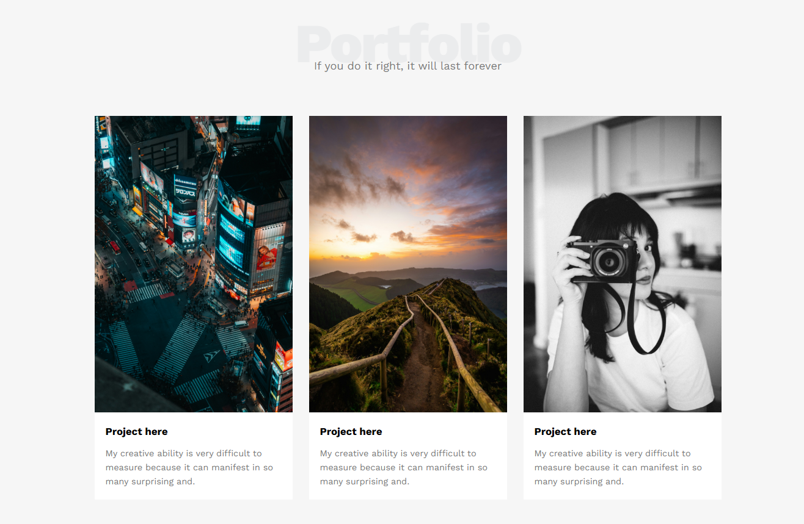
    </div>
  </details>
    </div>


### 🛠️ Tech Stack & Setup
* **Technologies Used:** HTML5, CSS3 (Custom Properties & CSS Grid Layouts).
* **Typography:** Work Sans font pairing.

---

## 🛠️ Global Installation & Setup

To launch and run any of these templates locally on your machine, follow these steps:

1. **Clone the repository:**
   ```bash
   git clone https://github.com
   ```
2. **Navigate into the workspace folder:**
   ```bash
   cd your-repository-name
   ```
3. **Launch the project files:**
   * Open the preferred project folder and double-click `index.html` to execute it directly inside your web browser.
   * *Alternative:* Right-click `index.html` inside VS Code and select **"Open with Live Server"** to view changes dynamically.

---
<p align="center">Made with ❤️ by Ahmed Hegazy</p>
